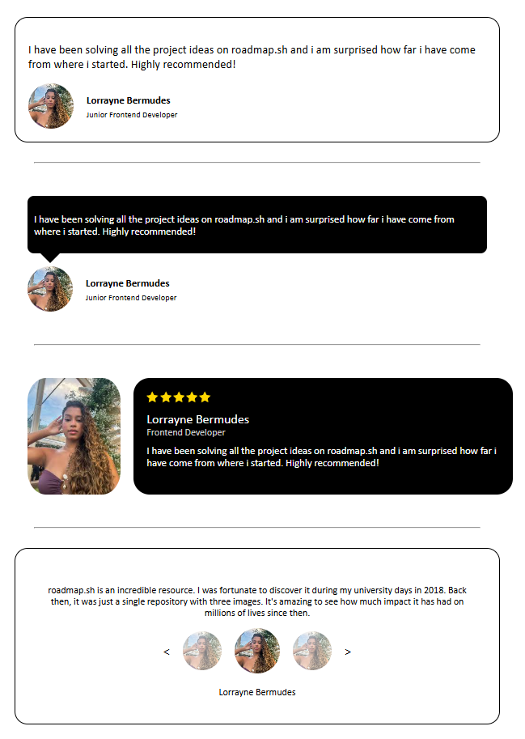

# Testimonial Cards

**Project 5 - Frontend - Roadmap.sh**
🔗 [Project link on roadmap.sh](https://roadmap.sh/projects/testimonial-cards)

## 📄 Description

In this project, you'll build a **set of testimonial cards** using only **HTML and CSS**.
**Testimonials** are quotes or statements from satisfied customers or users, often showcased on websites to build **credibility** and **trust**.

The main goal of this project is to help you practice **CSS positioning** and **layout techniques**, while creating visually appealing and organized testimonial sections.

## 📚 Project Goals

- Create multiple testimonial cards using semantic HTML.
- Use CSS to style and position the cards in a clean, professional way.
- Practice **Flexbox**, **Grid**, and other positioning strategies.
- Ensure the design is **responsive** and adapts well to different screen sizes.
- Focus on spacing, typography, and visual hierarchy to enhance readability.

